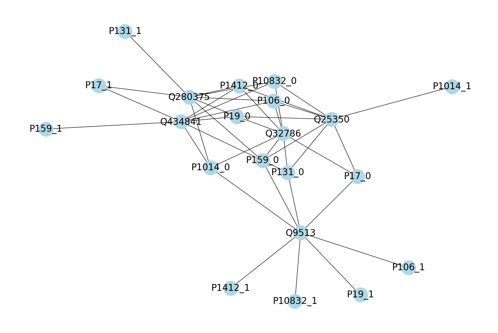
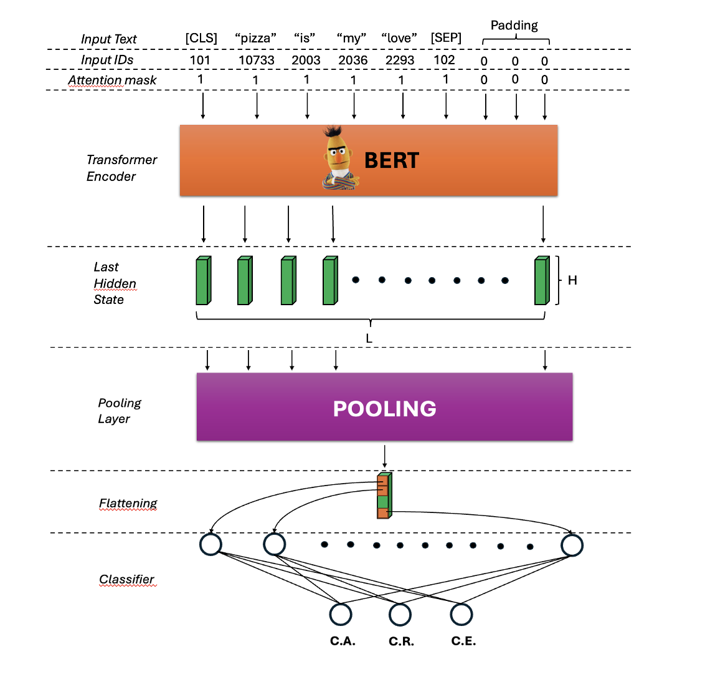

# Cultural Classification
The task of this homework consists in developing a non LM-based and an LM-based method for cultural classification among three classes: C.A. (cultural agnostic), C.R. (cultural representative) and C.E. (cultural exclusive). 


# TAs Instructions

1. **Clone the repository**:  
 ```sh 
 git clone "https://github.com/cybernetic-m/cultural_classification_nlp.git" 
 ```
2. **Re-Train the Non LM model**:
   
You can try to create a graph using the notebook "non_lm_based.ipynb".
  
  - Open the notebook on Google Colab
   
3. **Re-Train the LM model**:
   
You can try to do the Transformer Encoder training using the notebook "lm_based.ipynb".

4. **Test both models**:
   
You can test both models on the "test_unlabeled.csv" dataset using the notebook "hw1_romano_lissalattanzio.ipynb"

5. **Report reading**:

You can read the report "*Report_HW1_NLP_Romano_LissaLattanzio.pdf*".

# TAs GDrive Shared Folder

On the [Caponata_Lovers_shared_folder ](https://drive.google.com/drive/folders/1-i65074543er1y3tjMLZVbvj1Wa4dZ1Q?usp=drive_link)  you can see different files:

- "*processed_df_train.csv*", "*processed_df_validation.csv*": these are the two datasets with added information by us for the Non LM method
- "*train_df_wikipedia.csv*", "*test_df_wikipedia.csv*": these are the two datasets with added information by us for the LM method
- "*Caponata_Lovers_output_nonLM*", "*Caponata_Lovers_output_LM*": these are the two csv outputs by the models running "hw1_romano_lissalattanzio.ipynb" on the "test_unlabeled.csv" data.

# Repository Structure
 ```sh 
├── config.json
├── dataset
│   └── CulturalDataset.py
├── graph
│   ├── models
│   │   ├── category_encoder.pkl
│   │   ├── cultural_graph.json
│   │   └── subcategory_encoder.pkl
│   └── src
│       ├── graph.py
│       ├── process_data.py
│       ├── save_and_load.py
│       └── test.py
├── hw1_romano_lissalattanzio.ipynb
├── images
│   ├── image_1.png
│   ├── image_2.png
│   └── image_3.png
├── LICENSE
├── lm_based.ipynb
├── models
│   └── LMClassifier.py
├── non_lm_based.ipynb
├── README.md
├── Report_HW1_NLP_Romano_LissaLattanzio.pdf
├── src
│   ├── calculate_metrics.py
│   └── utils.py
├── testing
│   └── test.py
├── training
│   ├── train_one_epoch.py
│   └── train.py
└── wikipedia_data
    ├── processed_df_train.csv
    ├── processed_df_validation.csv
    ├── test_df_wikipedia.csv
    └── train_df_wikipedia.csv

 ```
- "*config.json*": this is a configuration file containing all the parameters for the LM-based method training (i.e. batch_size ...)
- "*hw1_romano_lissalattanzio.ipynb*", "*lm_based.ipynb*", "*non_lm_based.ipynb*": notenooks to upload on Colab to train or test the models (as described in TAs Instructions)
- "*processed_df_train.csv*", "*processed_df_validation.csv*",  "*test_df_wikipedia.csv*", "*train_df_wikipedia.csv*": all the preprocessed dataset also available on GDrive shared folder (as described in TAs GDrive Shared Folder)
- "*category_encoder.pkl*", "*subcategory_encoder.pkl*": saved Label Encoder used for the evaluation part of the Graph Method
- "*cultural_graph.json*": Graph trained saved and used for the evaluation part of the Graph Method
- "*Report_HW1_NLP_Romano_LissaLattanzio.pdf*": the report of the project
# Graph-based Method
The final graph structure we propose is a graph made of nodes entity, which contains the labels for the training set. The algorithm used on the graph is the Label Propagation. More detail in the report sections 2.1, 2.2.


# LM-based Method
In the LM-based method we have used a Transformer Encoder (like BERT) to extract features from text, a Pooling layer to aggregate all the hidden tensors and a Classifier layer (like a Linear or MLP layer) at the end for the final classification. More detail in report sections 2.3, 2.4, 2.5.




